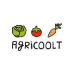

## Saudações

Somos um delivery de orgânicos, criando um meio para os produtores realizarem suas vendas sem a necessidade de um local físico, garantindo assim o aumento da sua renda, ao facilitar (e baratear) a entrega para seus clientes, que não precisam sair de casa para terem os alimentos mais fresquinhos!

Esperamos tornar o consumo de alimentos orgânicos algo mais acessível e atrativo ao cliente final, sempre mostrando de onde vem sua comida e os responsáveis por ela, tornando assim, o ato de se alimentar algo mais humano.

## Construção da aplicação

O site da Agricoolt possui as principais telas para realização de venda de produtos através da pesquisa e seleção de produtos, carrinho de compras e de pagamentos.

Utilizamos WordPress com PHP para a construção e configuração do site (Telas: página principal, Faça sua feira, Quem somos, Fale com a gente!), e Woocommerce integrado para o módulo de vendas com o tema StoreFront.

Para o Woocommerce utilizamos os plugins gratuitos: 
*_mailchimp-for-woocommerce_ para o envio de e-mails dos pedidos
*_preenche-endereco-cep_ para a busca de endereço por cep na tela de pagamentos
*_woo-checkout-field-editor-pro_ para customizar os campos padrões do Woocommerce de identificação do cliente na tela de pagamentos
*_woo-payment-on-delivery_ para poder customizar os meios de pagamentos: Pagamento na entrega habilitando possibilidade de o cliente informar se vai precisar de troco no caso de dinheiro; Transferência bancária para depósito diretamente na conta da Agricoolt

Criamos, customizamos e integramos toda a aplicação na Hostgator (www.hostgator.com)
